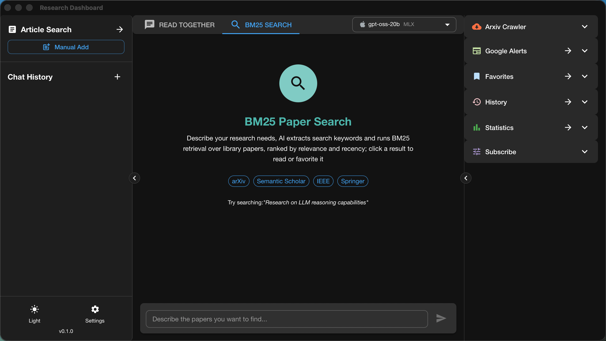
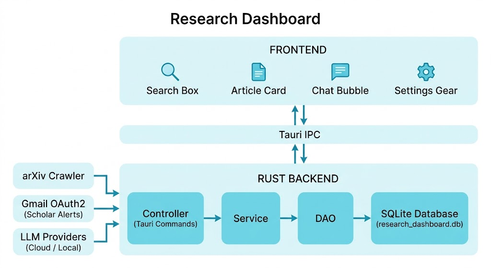
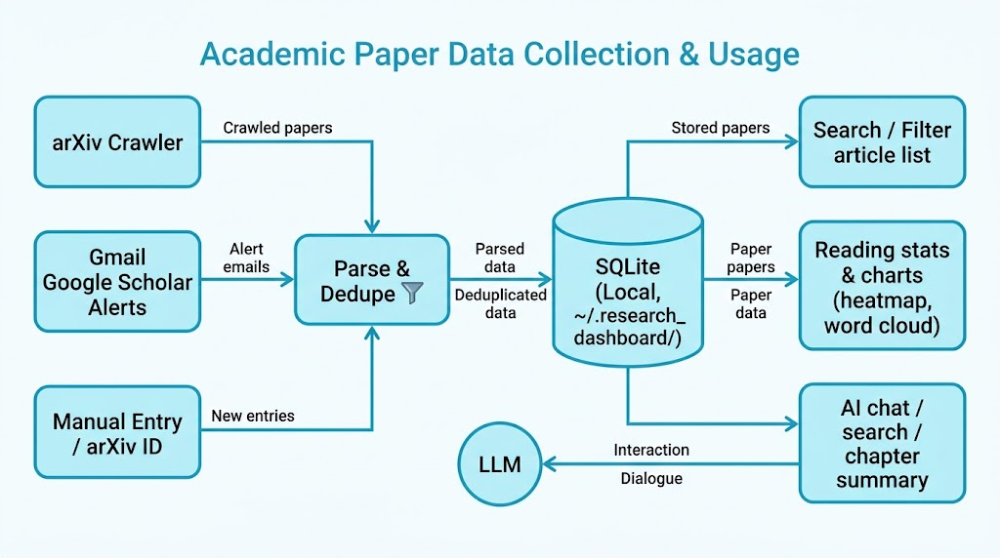

<div align="center">


# Research Dashboard

面向科研人员与论文爱好者的**桌面文献管理与 AI 阅读助手**

基于 Tauri + React + Rust，本地优先、数据完全由你掌控。

**跨平台桌面应用，支持 Windows / macOS / Linux。**

**[English](README.md) · [简体中文](README.zh-CN.md)**

</div>

<p align="center">
  
</p>

---

## ✨ 功能特性

### 📚 文献管理
- **文章库**：集中管理你关注的论文，支持关键词、日期范围、会议/期刊（CCF/JCR 分级）、领域多维筛选
- **期刊分级**：内置 CCF / JCR 期刊与会议排名，选刊一目了然
- **灵活录入**：支持手动添加、arXiv 编号一键补录，自动填充标题/作者/摘要
- **PDF 阅读**：内置 PDF 查看器，快速浏览全文

### 🤖 AI 对话助手（三种模式）
- **AI 聊天**：自由对话，答疑解惑、头脑风暴
- **AI 搜索推荐**：LLM 理解你的意图 → 检索本地文献库 → 生成带解释的推荐结果
- **章节总结**：上传论文 PDF（或关联库内 arXiv 论文），AI 逐章总结、辅助精读
- **多模型支持**：云端（OpenAI 兼容 API：Claude / GPT / DeepSeek 等）+ 本地（Apple MLX / Ollama 兼容服务）
- 上传 PDF 作为对话上下文，随时针对文献提问

### 🕷️ arXiv 定时爬虫
- 按订阅领域定时 / 手动爬取 arXiv 最新论文
- 智能断点：连续命中旧论文即停止，自动去重，不重复入库
- 每篇论文即时写入数据库，支持断网续爬

### 📬 每日推荐
- 集成 Gmail OAuth2，自动同步 **Google Scholar Alert** 学术推荐邮件，提取论文入库
- 论文自动匹配已有文献，避免重复

### ⭐ 订阅与收藏
- **订阅系统**：订阅关注作者 / 领域 / 关键词，文章列表一键按"订阅作者"筛选
- **收藏夹**：多级文件夹组织收藏，支持拖拽与移动

### 📈 阅读统计与历史
- 阅读/对话历史完整记录，按日期分组时间线查看
- 阅读统计：月度热力图、关键词云、领域分布、趋势曲线等可视化

### 💾 数据可迁移
- **导入 / 导出**：一键导出为标准 `.sql` 文件，支持全量 / 核心数据两种范围
- 数据可在不同设备、不同应用间流转，随时备份与恢复
- 数据存储在本地 SQLite（`~/.research_dashboard/`），完全由你掌控

### 🎨 个性化
- 右侧工具栏面板自由拖拽排序、隐藏展开
- 浅色 / 深色 / 跟随系统主题
- 中 / 英文界面切换

---

## 🚀 安装与使用

**Research Dashboard** 是一款跨平台桌面应用，支持 **Windows / macOS / Linux**，无需配置任何开发环境，下载安装即可使用。

> 安装包即将发布，发布后可在 GitHub Releases 页面下载对应平台的安装包（Windows / macOS / Linux）。

### 数据目录
所有数据默认保存在 `~/.research_dashboard/`：

| 路径 | 内容 |
|------|------|
| `research_dashboard.db` | SQLite 数据库（文章、收藏、订阅、历史、对话等） |
| `settings.json` | 应用设置与模型配置 |
| `layout.json` | 右侧栏布局 |
| `pdfs/` | 手动添加的非 arXiv 论文 PDF |

> 备份 / 迁移数据，推荐在「设置 → 数据导入导出」中导出 `.sql` 文件。

---

## 🛠️ 从源码构建（开发者）

> 以下内容面向开发者 / 贡献者；普通用户无需关心，直接使用安装包即可。

### 环境要求
- Node.js ≥ 18
- Rust（stable）
- Tauri 2 相关系统依赖（macOS 需 Xcode Command Line Tools）

### 运行（开发模式）
```bash
# 1. 安装前端依赖
npm install

# 2. 启动完整桌面应用（自动拉起前端 + Rust 后端）
npm run tauri dev
```

### 仅启动前端（浏览器调试）
```bash
npm run dev
```

### 后端独立命令（CLI）
```bash
# 手动触发一次 arXiv 爬取（无 GUI 环境也可用）
cargo run --manifest-path src-tauri/Cargo.toml -- --crawl
```

---

## 🏗️ 技术栈

| 层级 | 技术 |
|------|------|
| 桌面框架 | [Tauri 2](https://tauri.app) |
| 前端框架 | React 19 + TypeScript |
| UI 组件 | Material-UI (MUI) v9 + Emotion |
| 状态管理 | Zustand |
| 路由 | React Router |
| 构建工具 | Vite |
| 图表 | Recharts + d3-cloud（词云） |
| 拖拽 | dnd-kit |
| 国际化 | i18next |
| 后端语言 | Rust |
| 数据库 | SQLite（rusqlite bundled）+ r2d2 连接池 |
| 异步运行时 | Tokio |
| HTTP 客户端 | reqwest |
| HTML 解析 | scraper（arXiv 爬虫） |
| PDF 解析 | pdf-extract |
| 外部集成 | Gmail OAuth2（Google Scholar Alert 同步） |

---

## 📁 项目结构

```
research_dashboard/
├── src/                      # 前端（React）
│   ├── pages/                # 页面：主页 / 文章列表 / 收藏夹 / 历史 / 统计 / 每日推荐
│   ├── components/           # 组件：布局 / 文章卡片 / 设置 / 统计等
│   ├── stores/               # Zustand 状态管理
│   ├── i18n/                 # 中英文文案
│   └── types/                # TypeScript 类型定义
├── src-tauri/                # 后端（Rust + Tauri）
│   ├── src/
│   │   ├── controller/       # Tauri 命令入口（接口层）
│   │   ├── service/          # 业务逻辑层
│   │   ├── dao/              # 数据访问层（SQLite CRUD）
│   │   ├── models/           # 数据模型
│   │   ├── crawler/          # arXiv 爬虫引擎
│   │   ├── llm/              # 大模型接入（云端 / MLX / Ollama）
│   │   ├── gmail/            # Gmail OAuth2 与 Scholar Alert 同步
│   │   └── settings.rs       # 应用设置 / 存储管理
│   └── Cargo.toml
├── docs/                     # 设计文档
└── package.json
```

---

## 🧭 架构与数据流

<p align="center">
  
</p>

<p align="center">
  
</p>

**核心链路**：

```
数据来源（arXiv 爬虫 / Gmail Scholar Alert / 手动录入）
        │
        ▼
  解析与去重 ──► SQLite 本地数据库（~/.research_dashboard/）
        │                              │
        │                              ▼
        │                    前端检索 / 筛选 / 统计 / 推荐
        │                              │
        └────────────► LLM（云端 / 本地）交互：AI 聊天 / 搜索推荐 / 章节总结
```

---

## 🤝 贡献

本项目是开源的桌面应用，旨在让文献管理与 AI 阅读更轻松。欢迎提交 Issue、PR 或使用建议。

## 📄 License

本项目基于 [MIT License](./LICENSE) 开源发布，仅供学习交流使用。

---

*Made with ❤️ for research & reading.*
